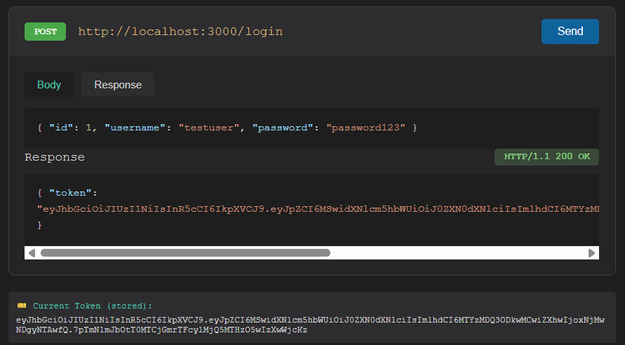
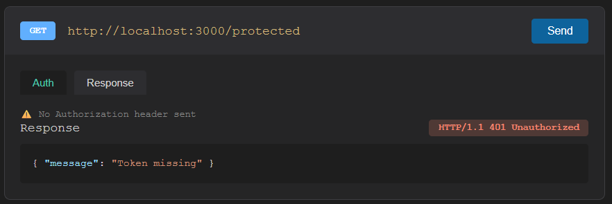
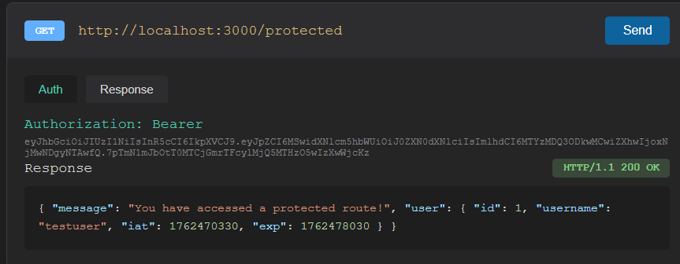

# Express JWT Auth - Project Files

This canvas contains a ready-to-upload project for a minimal Express server with JWT authentication. It includes the server file, `package.json`, `.gitignore`, and a `README.md` that references your three output images (`OUTPUT/output_1.png`, `OUTPUT/output_2.png`, `OUTPUT/output_3.png`).

---

## Files included (each shown below as a code block you can copy)

### 1) `server.js`
```javascript
const express = require('express');
const jwt = require('jsonwebtoken');

const app = express();
app.use(express.json());

const SECRET_KEY = 'your-secret-key-change-in-production';
const PORT = process.env.PORT || 3000;

// Hardcoded sample user
const user = {
  id: 1,
  username: 'testuser',
  password: 'password123'
};

// JWT verification middleware
const verifyToken = (req, res, next) => {
  const authHeader = req.headers['authorization'];
  const token = authHeader && authHeader.split(' ')[1]; // Bearer TOKEN

  if (!token) {
    return res.status(401).json({ message: 'Token missing' });
  }

  jwt.verify(token, SECRET_KEY, (err, decoded) => {
    if (err) {
      return res.status(401).json({ message: 'Invalid or expired token' });
    }
    req.user = decoded; // Attach user info to request
    next();
  });
};

// Login route - issues JWT token
app.post('/login', (req, res) => {
  const { username, password } = req.body;

  // Validate credentials
  if (username === user.username && password === user.password) {
    // Generate JWT token
    const token = jwt.sign(
      { id: user.id, username: user.username },
      SECRET_KEY,
      { expiresIn: '1h' }
    );

    return res.status(200).json({ token });
  }

  res.status(401).json({ message: 'Invalid credentials' });
});

// Protected route - requires valid JWT
app.get('/protected', verifyToken, (req, res) => {
  res.status(200).json({
    message: 'You have accessed a protected route!',
    user: {
      id: req.user.id,
      username: req.user.username,
      iat: req.user.iat,
      exp: req.user.exp
    }
  });
});

// Public route - no authentication required
app.get('/public', (req, res) => {
  res.status(200).json({ message: 'This is a public route' });
});

app.listen(PORT, () => {
  console.log(`Server running on http://localhost:${PORT}`);
});
```

---

### 2) `package.json`
```json
{
  "name": "express-jwt-auth",
  "version": "1.0.0",
  "description": "Minimal Express server with JWT authentication",
  "main": "server.js",
  "scripts": {
    "start": "node server.js",
    "dev": "nodemon server.js"
  },
  "author": "",
  "license": "MIT",
  "dependencies": {
    "express": "^4.18.2",
    "jsonwebtoken": "^9.0.0"
  },
  "devDependencies": {
    "nodemon": "^3.0.1"
  }
}
```

---

### 3) `.gitignore`
```gitignore
node_modules/
.env
.DS_Store
```

---

### 4) `README.md`
```markdown
# Express JWT Auth (Minimal)

A minimal Node.js + Express sample demonstrating JWT authentication. This project is intentionally small so you can quickly upload it to GitHub and test locally.

## Files
- `server.js` - Main Express server with `/login`, `/public`, and `/protected` endpoints.
- `package.json` - Project metadata and scripts.
- `.gitignore` - Files to ignore for Git.
- `OUTPUT/` - Put your `output_1.png`, `output_2.png`, `output_3.png` images here.

## Quick start
1. Clone or copy files into a folder.
2. Run:

```bash
npm install
npm start
```

3. Test endpoints (example using `curl`):

- Public route:

```bash
curl http://localhost:3000/public
```

- Login to get token:

```bash
curl -X POST http://localhost:3000/login \
  -H "Content-Type: application/json" \
  -d '{"username":"testuser","password":"password123"}'
```

- Use token to access protected route (replace `TOKEN`):

```bash
curl http://localhost:3000/protected -H "Authorization: Bearer TOKEN"
```

## Notes
- **Change `SECRET_KEY`** before using in production; do not commit secrets to Git.
- The sample uses a hardcoded user for simplicity. Replace with a real user store for real apps.

## Images
If you want the images to show on GitHub README, put them in the `OUTPUT/` folder at the root and reference like this in the README:

```markdown



```
```

---

## How to upload to GitHub (brief)
1. `git init`
2. `git add .`
3. `git commit -m "Initial commit"`
4. Create a repo on GitHub and follow the `git remote add origin ...` and `git push -u origin main` instructions.

---

Place your image files in the `OUTPUT/` folder before pushing if you want them displayed in the README.


